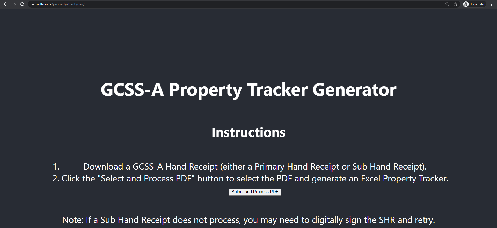

# Property Tracker Generator

Property tracker generator takes a GCSS-A generated hand receipt and transforms it to a useful Excel file that can be used to easily track property. Based on a defined monthly inventory schedule, it includes a projected month for particular property items to be viewed for a cyclic inventory.

## Usage

Browse to a location where `property-track` is desployed (for example `https://willson.ga/property-track/`) and select a GCSS-A hand receipt. The property tracker will output an Excel file with property split up in rows.

## Local Installation

1. Clone the repository to a computer that has the Node Package Manager installed.
2. `$ git clone git@gitlab.com:stevewillson/property-track.git`
3. `$ cd property-track`
4. `$ npm install`
5. `$ npm start`
6. Browse to `http://localhost:3000` to view the property tracker and process GCSS-A generated PHRs and SHRs.

Note: No files are transmitted away from the client computer when processing GCSS-A PHRs and SHRs, all work is done locally.

